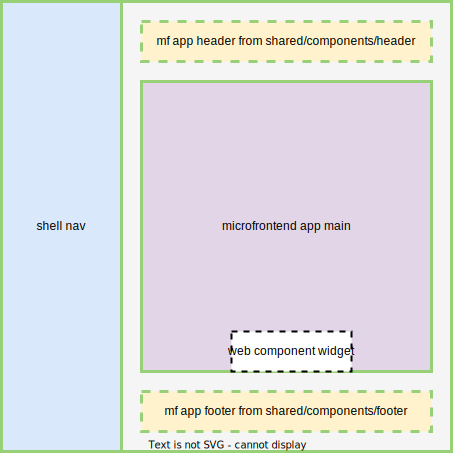

# Microfronteds with Vite and module federation

## This document describes a proof of concept project for microfrontends using `Vite` and module federation. It is based on `React`, and implemented in `TypeScript`. It is possible to achieve similar results using other frameworks, or vanilla js and import maps, but the focus here is on React and Vite.

<br />



<br />

### Table of Contents

### 1. [Introduction](#1-introduction)

### 2. [Structure and setup](#2-structure-and-setup)

### 3. [Host configuration and contracts](#3-host-configuration-and-contracts)

### 4. [Layout and styling](#4-layout-and-styling)

### 5. [Data sharing between microfrontends](#5-data-sharing-between-microfrontends)

### 6. [Development](#6-development)

### 7. [Deployment](#7-deployment)

### 8. [Common issues](#8-common-issues)

### 9. [Integration of an external web app using web component](#9-integration-of-an-external-web-app-using-web-component)

### 10. [Recommended resources](#10-recommended-resources)

<br />
<br />

### 1. Introduction <a name="1-introduction"></a>

This project is a proof of concept for microfrontends using Vite and module federation. It is based on the [Vite + Module Federation plugin](plugin). React is the 'metaframework' and glue of the system. Host application is a React application and the microfrontends are also React applications. The project contains both page and component level microfrontends. It is a runtime integration, meaning that the microfrontends can be deployed separately and the host application is responsible for loading them at runtime. The host application is also responsible for the routing and the layout of the microfrontends. <br />The microfrontends are not aware of the host application and can be deployed independently.
In this example, the micro apps and the host all run React, but it is possible to use other frameworks as well - such apps need to be built as a web component and hosted within a React container - effectively creating a mix of runtime and buildtime integration. However, since Vite supports other frameworks and the module federation plugin is seems to be compatible with Webpack module federation plugin, it might be possible to integrate other frameworks without using web component as a wrapper - but this was not tested at the time of writing.<br />
Also, the web component here was used as a simple widget and not a page level microfrontend, as this project focuses on the integration of microfrontends at page level - with each page being a separate React app.

<br />
<br />

### 2. Structure and setup <a name="2-structure-and-setup"></a>

For the sake of simplicity, the project is contained in 1 repository and structured as follows:

- shell application folder
- app1 microfrontend folder
- app2 microfrontend folder
- webcomponent1 microfrontend folder

The root contains a `docker-compose` file for demonstration purpose. It contains the shell application and all the microfrontends running as separate containers. All of these are static files served by nginx. Running the `docker-compose` file makes it easy to observe the dependencies between elements of the system, and allows to change and redeploy them separately simply by rebuilding their respective docker file.
<br />
It also serves as proof of concept for the deployment of this system, as one can simply run it locally, or deploy the `docker-compose` file to a server and the system will be up and running.

<br />
<br />

### 3. Host configuration and contracts <a name="3-host-configuration-and-contracts"></a>

Module federation plugin governs the communication between the host and the microfrontends. It is configured in the host application's vite.config.js file. The most important part of the config is specifying the modules (`remotes`) and common libraries (`shared`) that the host application will expose to the microfrontends. The microfrontends will then be able to import these modules and libraries from the host app.
These names and location of modules, and the common dependencies lists form the only contract between the host and the microfrontends. The `remotes` is an object with namespaces as keys, and the values must be urls where the resoures are available - here it is specified in the `.env` file and mirrored in the `docker-compose` file, but obviously a more robust solution must be used in a real environment.
<br />
<br />
Since the host is responsible for routing and building the whole structure, these modules are used in the `shell/routes.tsx` to both load the individual apps and build the navigation. Each app is loaded from its namespace declared in the `remotes` object, and accessed via the name exposed in their own module federation plugin config. Example: `shell/routes.tsx` loads an app level component on line 12

```
const ModuleMap: Record<string, Component> = {
  app1: lazy(() => import("app1/App")),
  ...
};
```

This "...`import("app1/App")`" means that the namespace declared in the `remotes` object is called `app1` and it has an export named `App`. This information must also be specified in the `app1/vite.config.js` in the `exposes` object. The `exposes` object is used to specify the modules that the host will be able to import from the microfrontend, and it's setup must be aligned with that of the host app!
<br />
Note: the `shared` object is used to specify the common dependencies that the host will expose to the microfrontends. The `shared` object is optional, but it is recommended to use it to avoid loading the same libraries multiple times, which usually leads to bugs when frameworks are loaded several times. This also needs to be aligned between the host and the microfrontends.
<br />

<br />
<br />

### 4. Layout and styling <a name="4-layout-and-styling"></a>

In this simplistic example, the layout is handled by the shell app that applies a simple grid layout to the microfrontends. The microfrontends are not aware of the layout or styling. Obviously, this is not a scalable solution, but it is a good starting point for a proof of concept. In a sustainable solution, a common styling library should be used where each of the microfronteds load layout level components, or style sheets, thus ensuring that the layout is consistent across the whole system. A starting point is made where the microfrontends can load a layout component from the host app, but this is commmented out in this example as it does not work out of box the when deploying with Docker.

<br />
<br />

### 5. Data sharing between microfrontends <a name="5-data-sharing-between-microfrontends"></a>

There are only 6 reasonable ways to share the state across microfrontends:

- A window level observable uses the global window object as the medium to share the data, often wrapped into a pub-sub library; or a similar global data bus approach (kinda ok, but not really)

- Web storage, such as Local Storage, Session Storage or Cookies

- URL via query / params

- In-memory (e.g. Redux) shared between apps that share the same framework

- Backend (session or persisted state) (related: to web storage)

- Props and Custom events / Callbacks (available in all frameworks, but actually only viable for React and/or web components)

This example uses the query params approach. An example is implemented in `app2/src/App.tsx` lines 27-29 and 41, where a query param is added to the url when the button is clicked, and the query param is read when the app1's page is loaded. This param is the used an initial value for a an input in `app1/src/User.tsx` lines 10-11 and 20.
<br />
Deep links and URL params might be used as navigation redirects, filters for a BE request, initial values, anything that is not sensitive and can be shared with other apps, or with people.
<br />
It is a safe solution, but not really scalable. It advantage lies in versatily and simplicty, and also adds to the case that the microfrontends are unaware of each other.

<br />
<br />

### 8. Development <a name="8-development"></a>

In this simple example, it is possible to run `yarn vite dev` inside each of the app and develop each app individually. Note that there is a react-router-bug inside app1 (need to fix a condition preventing loading 2 instances or BrowserRouter), and to develop the web component example you only need to edit it's source (`webcomponent1/index.js`) file.
<br />
The interactions are best observed if the system is run using `docker-compose`, and the containers rebuild when the files are changed. A similar result can be achieved using the scripts specified in `package.json` in the root folder, or a combination of the scripts inside each of the app folders - but this is as convenient as the docker proposal.

<br />
<br />

### 7. Deployment <a name="7-deployment"></a>

The docker-compose file is a good starting point for deployment. It is possible to run the system locally using `docker-compose up`, and it is also possible to deploy it as a whole to a server.
<br />
However, it makes much more sense to deploy each `Dockerfile` thru a separate CI/CD pipeline. This way, each microfrontend app can be deployed independently, and the host app can also be deployed separately.
<br />
Each of these `Docker` files runs a build provess and then serves its contents as static files using `nginx`, as this seems to be the most versatile and simple solution.

<br />
<br />

### 8. Common issues and pitfalls <a name="8-common-issues-and-pitfalls"></a>

Pitfalls and common issues are mostly related to 3 things: deep routing within the microfrontends, authorization and authentification, and data sharing.

- elaborate on deep routing

<br />
<br />

### 9. Integration of an external web app using web component <a name="9-integration-of-an-external-web-app-using-web-component"></a>

It is possible to integrate any js application as a web component, and then use it in a microfrontend. It works just as fine for a page level components, or standalone widgets. This is a good solution for external apps, or simple widgets made with other any technologies. The only requirement the source is a javascript file and is made available using a url.
<br />
A web component can be built using any framework, and it can be used in any framework.
It can be updated by simply updating its source file. Due to the relative overhead of such a solution, it is recommended to use it only for legacy apps, or apps that are not built using React framework, or standalone widgets that for whatever reason are not meant to be npm packages, but rather a simple js file that can be loaded from a url.
<br />
Web components also allow for style encapsulation, which itself both has advantages and disadvantages, depending on the use case. This topic is not covered in this example.
<br />
Integrations of external apps using iframes or other similar solutions are not covered in this example, as they are not recommended for a microfrontend architecture due to their natural limiations.

<br />
<br />

### 10. Recommended resources <a name="10-recommended-resources"></a>

There are many resources available on the internet, but here are some of the best ones:

- https://www.mercedes-benz.io/2023/01/05/you-might-not-need-module-federation-orchestrate-your-microfrontends-at-runtime-with-import-maps/
- https://dev.to/luistak/cross-micro-frontends-communication-30m3
- https://www.youtube.com/watch?v=tI8RYB5rcVw
